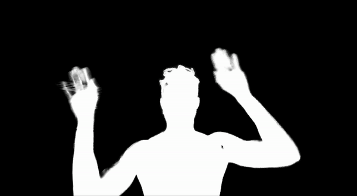

# Robust Video Matting

Robust video matting for human segmentation.

## Running the Sample
Retrieve your access key from [NatML Hub](https://hub.natml.ai/profile) and add it to your Project Settings:

## Using the Predictor in a Different Project
[See the predictor README for more details](Packages/ai.natml.vision.robust-video-matting/README.md).

## Requirements
- Unity 2021.2+

## Supported Platforms
- Android API level 24+
- iOS 14+
- macOS 10.15+ (Apple Silicon and Intel)
- Windows 10+ (64-bit only)
- WebGL:
    - Chrome 91+
    - Firefox 90+
    - Safari 16.4+

## Resources
- Join the [NatML community on Discord](https://natml.ai/community).
- See the [NatML documentation](https://docs.natml.ai/unity).
- See the [VideoKit documentation](https://docs.natml.ai/videokit).
- Check out [NatML on GitHub](https://github.com/natmlx).
- Read the [NatML blog](https://blog.natml.ai/).
- Contact us at [hi@natml.ai](mailto:hi@natml.ai).

Thank you very much!